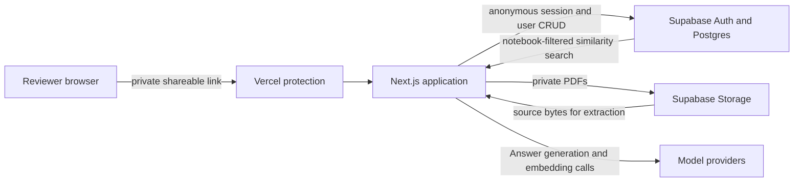
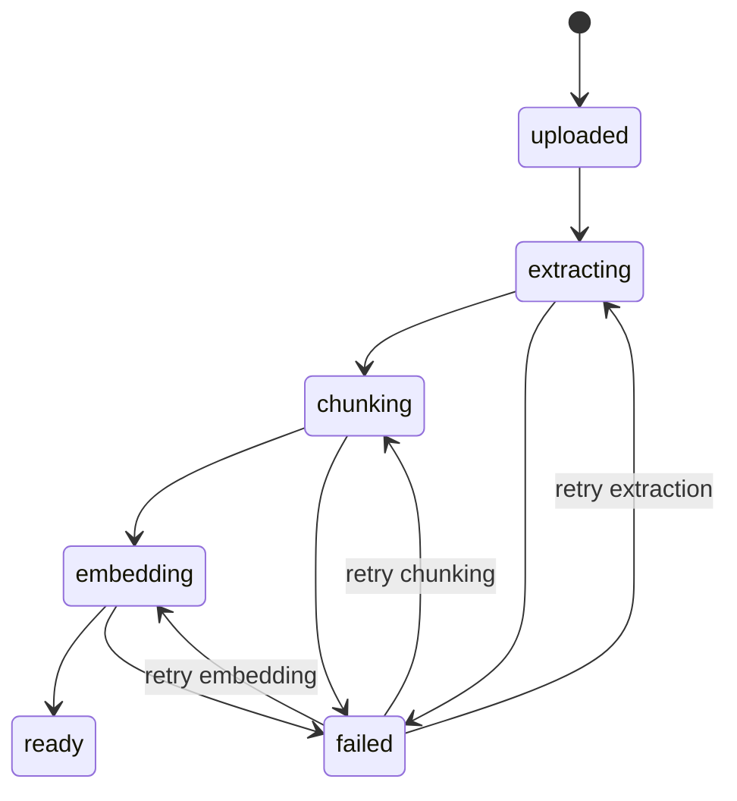

# NotebookLM-Clone Architecture

Status: implemented through the grounded Question and Citation journey; private Source ingestion and Notes remain planned

This architecture optimizes for a credible full-stack interview demonstration within a 15–20 hour delivery budget. It favors narrow interfaces, explicit ownership, recoverable processing, and inspectable grounding over production-scale infrastructure.

Canonical product terms are defined in [CONTEXT.md](./CONTEXT.md). Product commitments and cut lines are defined in [PRODUCT.md](./PRODUCT.md).

## Stack

| Concern | Choice |
| --- | --- |
| Web application | Next.js, React, and TypeScript |
| Styling | Tailwind CSS and shadcn/ui |
| Hosting | Vercel |
| Database, authentication, and file storage | Supabase |
| Retrieval | Postgres with pgvector |
| Deployment gate | Vercel-protected preview shared through a private shareable link |
| Generation and embeddings | Cloudflare Workers AI for embeddings; Answer generation provider selected during setup |

The private Vercel link is the reviewer's access credential. It is not a substitute for application quotas, database authorization, or provider-level budget ceilings.

## System shape

The Next.js application owns orchestration and privileged work. Supabase owns durable identity, authorization, records, files, and vector search. Model providers never receive credentials or requests directly from the browser.

## Request and rendering model

- Create or restore the Supabase anonymous session through dynamically rendered Next.js code. Do not statically cache identity-bearing output.
- Allow the authenticated browser client to perform ordinary Guest CRUD through Supabase under RLS.
- Keep file extraction, Passage creation, embeddings, vector retrieval, model calls, quota enforcement, and all service-role operations in server-only code.
- Use relative same-origin requests for application routes so protected preview cookies remain attached.
- Never expose a Supabase service-role key, model credential, raw embedding, or unrestricted retrieval function to the browser.

## Domain records

The names below are conceptual. Exact SQL names may vary, but the relationships and invariants must remain visible.

| Record | Purpose and important fields |
| --- | --- |
| `notebooks` | Title, owner Guest or Example Notebook marker, timestamps |
| `sources` | Notebook, kind, original location, Processing Stage, failure metadata, size and page/character counts |
| `passages` | Source, stable ordinal, text, embedding, PDF page or pasted-text paragraph, extraction metadata |
| `conversations` | Notebook and owning Guest; unique for that pair |
| `messages` | Conversation, role, content, completion state, model metadata, timestamps |
| `citations` | Answer message, Passage, display order, quoted location metadata |
| `notes` | Notebook, owning Guest, originating Answer, saved content, timestamps |
| `usage_counters` | Guest, UTC date, successful Question count |

### Important relationships

- A Notebook has many Sources.
- A Source has many Passages.
- A Guest has at most one Conversation in a Notebook.
- A Conversation has ordered Messages.
- An Answer has zero or more Citations, but a substantive grounded Answer is successful only with at least one valid Citation.
- A Citation references exactly one Passage.
- A Guest may save an Answer as one or more Notes only within a Notebook they can read.
- An Example Notebook is readable but immutable to Guests; its Conversations and Notes are still Guest-owned.

## Authorization model

Supabase anonymous sign-in creates a real authenticated identity. RLS must distinguish that Guest from unauthenticated requests and must be enabled on every exposed table.

| Record | Read | Create or mutate |
| --- | --- | --- |
| Private Notebook | Owner only | Owner only |
| Example Notebook | Any authenticated Guest | Deployment seed or privileged server only |
| Private Source and Passage | Owning Notebook's owner | Owning Notebook's owner through allowed server workflow |
| Example Source and Passage | Any authenticated Guest | Deployment seed or privileged server only |
| Conversation and Message | Owning Guest only | Owning Guest through allowed application flow |
| Note | Owning Guest only | Owning Guest only |

Supabase Storage uses a private bucket. Guest PDF paths are scoped by Guest, Notebook, and Source identifiers. Storage policies check authenticated ownership; original Example Notebook files are managed only by the deployment seed. Authorization is enforced again in privileged server operations before the service role is used.

## Deep modules and seams

The design avoids generic pass-through wrappers around Supabase. Modules are introduced where they hide meaningful policy or where more than one adapter is known to exist.

### Source Reader

**Interface:** Accept original Source content and return ordered, location-aware text suitable for Passage creation, or a classified extraction failure.

**Depth:** Hides PDF parsing, pasted-text normalization, page and paragraph location preservation, empty-content detection, and parser-specific failures.

**Adapters:** PDF and pasted text. This is a real seam because two content forms vary behind the same interface.

### Source Ingestion

**Interface:** Advance one Source through its next valid Processing Stage and return its persisted state.

**Depth:** Owns transition validation, idempotency, locking, limits, extraction, Passage construction, embedding batches, retry metadata, and cleanup. Callers do not coordinate individual storage or database steps.

### Retrieval

**Interface:** Given an authorized Notebook and Question, return an ordered evidence set of location-aware Passages plus an adequacy result.

**Depth:** Hides Question embedding, ready-Source filtering, notebook-scoped pgvector search, thresholds, result count, and evidence formatting. The same interface is exercised by application calls and the retrieval evaluation.

### Grounded Answering

**Interface:** Given an authorized Conversation and Question, produce streamed Answer events and a final validated result.

**Depth:** Owns quota checks, Question persistence, Retrieval, prompt construction, source-instruction isolation, model invocation, Citation parsing and validation, completion persistence, and failure cleanup.

### Model adapters

Two small deployment-time interfaces isolate real variation:

- An Answer-model adapter streams text and structured Citation identifiers.
- An embedding-model adapter maps text to a fixed-dimension vector.

Only one configured adapter for each interface ships in the committed deployment. There is no runtime provider selector or multi-provider product surface.

## Source ingestion flow

1. Validate declared type, detected type, size, page or character limits, Notebook ownership, quota, and concurrency.
2. Store the PDF in the private bucket or persist normalized pasted text; create the Source as `uploaded`.
3. The client requests an advance. The server atomically claims the expected stage.
4. The Source Reader extracts ordered text and preserves PDF pages or pasted-text paragraphs.
5. Source Ingestion creates stable, overlapping Passages without embeddings.
6. Source Ingestion embeds Passages in bounded batches and stores vectors of one configured dimension.
7. Mark the Source `ready` only when every required Passage is queryable.
8. On failure, store a safe error category, retry stage, attempt count, and correlation identifier. Retrying repeats only an idempotent stage.

This is request-driven orchestration, not a durable background queue. Persisted stages allow refresh and retry without placing the entire ingestion pipeline in one long request.

## Grounded Question flow

1. Authenticate the Guest and authorize access to the Notebook and Conversation.
2. Enforce the per-Guest daily Question limit and deployment-level ceiling.
3. Persist the Question with a correlation identifier.
4. Ask Retrieval for notebook-scoped evidence from `ready` Sources only.
5. If evidence is inadequate, persist an insufficient-evidence Answer without calling on general model knowledge.
6. Give the model only the retrieved Passage text, stable Passage identifiers, and instructions that Source content is untrusted data.
7. Stream provisional text when supported.
8. Parse claimed Passage identifiers and validate that every one belongs to the retrieved evidence set.
9. Persist the completed Answer and Citations in one transaction. Invalid Citation output is repaired once or returned as a safe failure; it is never silently accepted.
10. Increment usage only for a successfully completed model Answer.

The Citation inspector requests the stored Passage by ID after an ownership check and displays its exact text, Source title, and PDF page or pasted-text paragraph.

## Retrieval strategy

- Generate Source and Question embeddings with the same configured model and dimension.
- Filter candidates to the current Notebook and Sources whose Processing Stage is `ready` before similarity ranking.
- Use cosine similarity through a narrowly permissioned Postgres function.
- Begin with an exact scan for the small demo corpus; add an HNSW index only if measured scale warrants it.
- Treat Passage size, overlap, result count, and adequacy threshold as evaluated configuration rather than UI settings.
- Test retrieval with a small fixed corpus containing approximately five Questions and their expected supporting Passages. Evaluate evidence retrieval and Citation validity, not exact generated prose.

## Failure behavior

| Failure | User-visible behavior | Persisted behavior |
| --- | --- | --- |
| Unsupported or deceptive file type | Reject before processing with allowed formats | No Source or a terminal validation record |
| Oversized PDF or pasted text | Explain the exact limit | No processing attempt |
| Empty or unreadable PDF | Mark Source failed and offer retry or delete | Safe extraction category and correlation ID |
| Embedding provider failure | Mark embedding failed and offer retry | Existing Passages remain; no Source becomes ready |
| Weak retrieval evidence | Explain that the Sources do not support the Question | Persist insufficient-evidence Answer |
| Invalid model Citation | Do not present an unverified Citation | Repair once, then persist safe failure |
| Stream interruption | Show retry state | Do not store partial output as a completed Answer |
| Quota reached | Disable Question submission and show reset policy | Do not call the model provider |
| Deleted Source referenced by history | Keep the historical Answer and label its Citation unavailable | Cascade Source and Passage data; retain Answer text |

## Security and cost controls

- Keep credentials in Vercel environment configuration and publish only safe names in `.env.example`.
- Use a protected Vercel preview and revoke or rotate its shareable link after the interview.
- Enforce RLS on all exposed records and ownership policies on private Storage objects.
- Treat file names, MIME declarations, extracted text, and model output as untrusted input.
- Detect content type independently of file extension and never execute uploaded content.
- Treat instructions found inside Sources as quoted research material, not model instructions.
- Apply per-Guest resource limits, a 20-Question UTC daily limit, request throttling, and provider budget alerts or hard ceilings.
- Do not log Source contents, retrieved Passage text, full prompts, Answer text, credentials, or authentication tokens.
- Avoid rendering or storing unnecessary personally identifiable information; Guests provide none.

## Observability

Structured server logs include:

- Correlation identifier
- Operation and Processing Stage
- Guest, Notebook, and Source identifiers when applicable
- Duration and outcome
- Input size or page count, but not content
- Provider and model identifier
- Model latency and token usage when reported
- Safe error category

Vercel and Supabase dashboards are sufficient for the committed scope. Sentry and product analytics remain stretch work.

## Verification strategy

### Unit

- Passage construction preserves ordering, overlap, and Source locations.
- Citation validation accepts only retrieved Passage identifiers.
- Resource and daily usage limits enforce boundary values.
- Processing Stage transitions reject illegal or duplicate work.

### Integration

- Migrations and seed create a readable, immutable Example Notebook.
- RLS isolates two Guests across Notebooks, Conversations, Messages, Notes, and Storage.
- Source Ingestion is idempotent at every Processing Stage.
- Retrieval filters to the authorized Notebook and ready Sources.
- A completed Answer and its Citations persist atomically.

### Browser-level

One principal test opens the Example Notebook as a fresh Guest, asks a known Question, receives a grounded Answer, opens a Citation, and sees the expected Passage. A second focused path may cover Source ingestion if it remains stable and fast enough for CI.

### Retrieval evaluation

A small deterministic fixture checks whether each known Question retrieves its expected supporting Passage within the configured result count. Generated prose is intentionally outside exact-match assertions.

## CI and deployment checks

- Formatting, linting, and TypeScript checks
- Unit and integration tests
- Retrieval evaluation
- Production build
- Browser-level test against a suitable test environment
- Migration and seed verification
- Manual incognito check of the protected shareable link and Guest isolation before submission

Automation that exercises a protected Vercel deployment uses a dedicated deployment-protection bypass secret, never the reviewer's shareable URL.

## Confirmed decisions

| Decision | Chosen approach |
| --- | --- |
| Product shape | NotebookLM-inspired, not feature parity |
| Hosting | Vercel rather than Cloudflare |
| Review access | Protected preview with private shareable link |
| Application identity | Automatic Supabase Guest; permanent login is stretch |
| Source formats | PDF and pasted text |
| Grounding | Passage embeddings and notebook-scoped pgvector retrieval |
| Conversation model | One persistent Conversation per Guest per Notebook |
| Example data | Shared immutable Sources; private Conversation and Notes |
| Processing | Request-driven, persisted, retryable Processing Stages |
| Trust model | Validated Passage Citations and insufficient-evidence behavior |
| Data access | Browser CRUD under RLS; privileged and AI work server-only |
| Observability | Structured, content-free logs in existing platform dashboards |
| Embedding provider | Cloudflare Workers AI with `@cf/baai/bge-small-en-v1.5`, 384 dimensions, and `cls` pooling |
| Answer provider | Cloudflare Workers AI JSON Mode with a server-selected model; default `@cf/meta/llama-3.1-8b-instruct-fast` |
| Answer delivery | Buffered structured output so Citation validation finishes before any Answer is presented as complete |
| Retrieval defaults | Five Passages with a `0.42` cosine-similarity floor, both server-configurable |
| Example Sources | Attributed excerpts from NIST AI 100-1 and NIST AI 600-1 under NIST Technical Series reuse terms |

These are recorded here as the current shipped baseline; later provider or workflow changes should preserve the same Retrieval and Grounded Answering interfaces.

## Unresolved decisions

These unknowns must not expand the committed product scope.

| Decision | Owner | Resolve by | Acceptance test | Fallback |
| --- | --- | --- | --- | --- |
| PDF extraction library | Builder | Narrow ingestion spike | Extracts representative text PDFs, preserves page numbers, rejects empty/encrypted failures safely, and works in Vercel's runtime | Select the next small server-compatible parser that passes the same contract tests |
| Passage size and overlap | Builder | Retrieval spike | Five-Question fixture retrieves expected Passages without excessive prompt volume | Start with conservative fixed-size overlapping Passages and tune only against the fixture |
| Global provider budget and daily deployment ceiling | Candidate | Before first shared deployment | Provider and application stop new model work at the chosen spend ceiling | Disable new Questions while leaving the Example Notebook readable |

## References

- [Supabase anonymous sign-ins](https://supabase.com/docs/guides/auth/auth-anonymous)
- [Supabase Row Level Security](https://supabase.com/docs/guides/database/postgres/row-level-security)
- [Supabase semantic search](https://supabase.com/docs/guides/ai/semantic-search)
- [Supabase Storage access control](https://supabase.com/docs/guides/storage/security/access-control)
- [Cloudflare Workers AI JSON Mode](https://developers.cloudflare.com/workers-ai/features/json-mode/)
- [Cloudflare Workers AI REST API](https://developers.cloudflare.com/workers-ai/get-started/rest-api/)
- [Vercel deployment protection](https://vercel.com/docs/deployment-protection)
- [Vercel deployment-protection sharing](https://vercel.com/docs/deployments/sharing-deployments)
